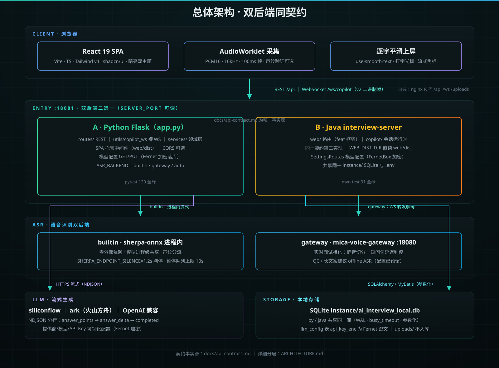
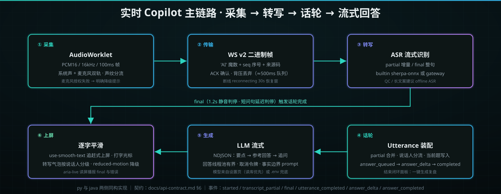
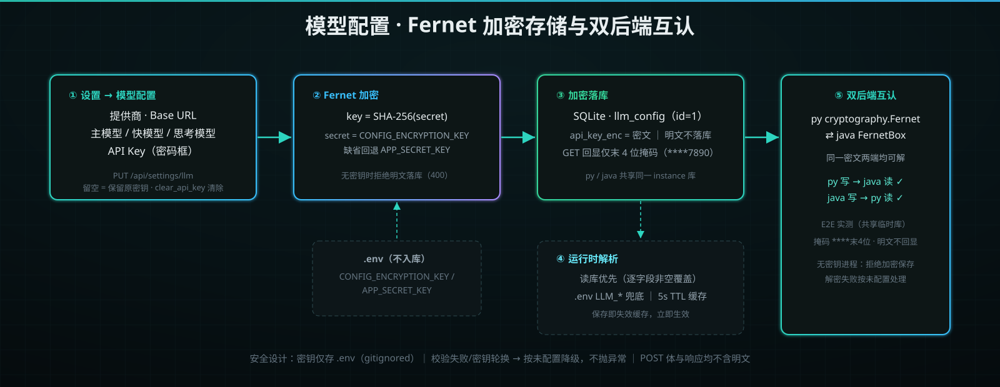

<div align="center">


[](https://www.python.org)
[](https://flask.palletsprojects.com)
[](https://openjdk.org)
[](https://react.dev)
[](https://sqlite.org)
[](LICENSE)

[](#-测试与验收)
[](#-测试与验收)
[](#-测试与验收)
[](#-模型配置设置页加密存储)

`双后端同契约：Python Flask ｜ Java interview-server，二选一部署` · `SPA 前端一次构建，两个后端同源托管`

**架构总览**：[ARCHITECTURE.md](ARCHITECTURE.md) ｜ **接口契约**：[docs/api-contract.md](docs/api-contract.md) ｜ **开发历程**：[README_PLAN.md](README_PLAN.md)

</div>

---

## 📖 目录导航

[✨ 项目亮点](#-项目亮点) ｜ [🏗️ 总体架构](#️-总体架构) ｜ [⚡ 实时主链路](#-实时主链路) ｜ [🧩 服务矩阵](#-服务矩阵) ｜ [📁 仓库结构](#-仓库结构) ｜ [🚀 快速开始](#-快速开始) ｜ [🔌 端口规划](#-端口规划) ｜ [🤖 模型配置](#-模型配置设置页加密存储) ｜ [⚙️ 环境变量](#️-环境变量) ｜ [🧪 测试与验收](#-测试与验收) ｜ [📚 文档地图](#-文档地图) ｜ [⚠️ 业务边界](#️-业务边界与免责声明) ｜ [🛠️ 开发约定](#️-开发约定) ｜ [📄 许可证](#-许可证)

## ✨ 项目亮点

- 🎯 **同一份岗位上下文贯穿全程** —— 面试计划（公司/岗位/JD/简历/技术标签）→ 生成 30/60/90 秒自我介绍与准备包 → 实战 → 复盘 → 简历优化，闭环而非孤立对话；
- 🎙️ **实时 Copilot** —— 浏览器 AudioWorklet 采集 PCM16/16kHz，裸 WebSocket 二进制帧（v2 带序号 ACK + 背压丢弃），增量转写、说话人分流（声纹验证 + 采集来源），面试官问完自动给出回答要点与参考回答；
- 🤖 **双后端同契约** —— Python Flask 与 Java interview-server 实现同一份 REST+WS 契约，前端无感切换；`docs/api-contract.md` 为唯一事实源；
- 🔐 **模型配置可视化 + 加密存储** —— 设置页配置提供商/模型/API Key，Fernet 加密落库（密钥来自 `.env`，明文不回显），**py 与 java 双向解密互认已实测**；运行时读库优先、`.env` 兜底；
- 🗣️ **ASR 双后端** —— `ASR_BACKEND=builtin`（进程内 sherpa-onnx 流式，自解析零依赖）/ `gateway`（mica-voice-gateway，18080 解码服务）/ `auto` 自动降级；网关为实时面试特化（静音判停 + 短问句延迟判停），QC/长文案建议走 offline ASR；
- 📝 **流式逐字平滑** —— LLM 流式分片整块到达、前端 `use-smooth-text` 逐字上屏（追赶式速度自适应），转写气泡与参考回答带打字光标与流式角标；
- 📊 **统一复盘** —— 汇总实时辅助与模拟面试的问题、多维评分（ScoreRing/Progress）、事实风险与下一步任务，一键转简历优化；
- 🧪 **工程质量** —— py 120 + java 91 测试全绿、依赖通告归零（pip-audit 复扫）、模型配置双后端 E2E 实测、reduced-motion 全局降级、暗/亮双主题令牌体系。

## 🏗️ 总体架构

<div align="center">



</div>

浏览器 AudioWorklet 采集 PCM16 → 裸 WS `/ws/copilot` → 18081 双后端（py / java 二选一，同一份契约）→ 进程内或网关 ASR + 流式 LLM → SQLite 单机存储。完整分层与数据流见 [ARCHITECTURE.md](ARCHITECTURE.md)。

```text
客户端 ──REST /api──▶ 18081 入口（py｜java）──▶ ASR（builtin 进程内 ｜ gateway :18080）
       ──WS /ws/copilot（v2 帧）─┘            └──HTTPS 流式──▶ LLM（siliconflow/ark/OpenAI 兼容）
18081 ◀──▶ SQLite instance/（py·java 共享，模型配置 Fernet 加密行）
```

## ⚡ 实时主链路

<div align="center">



</div>

六段全链路：**采集**（双轨 + 声纹分流）→ **传输**（v2 帧 seq/ACK + 背压丢弃）→ **转写**（partial/final，1.2s 判停）→ **话轮装配**（说话人分流、当前题落库）→ **LLM 流式**（NDJSON 三段产出、取消令牌）→ **逐字平滑上屏**（转写气泡按说话人分级、aria-live 读屏支持）。事件与载荷契约见 [docs/api-contract.md §6](docs/api-contract.md)。

## 🧩 服务矩阵

| 组件 | 技术栈 | 职责 | 端口 |
|---|---|---|---|
| web/ 前端 | React 19 · Vite · TS · Tailwind v4 | SPA 页面 + AudioWorklet 采集，产物 `web/dist` | —（由后端托管）|
| Python 后端 | Flask 3.1 · flask-sock · SQLAlchemy · sherpa-onnx | 页面/REST/WS 全量契约 + 进程内 ASR | 18081 |
| Java 后端 | interview-server（feat 框架）| 同一份契约的第二实现，共享同一 SQLite | 18081 |
| mica-voice-gateway | Java · sherpa-onnx | ASR 解码特化服务（实时面试判停策略） | 18080 |

## 📁 仓库结构

| 目录 | 内容 |
|---|---|
| `web/` | React 前端工程（构建产物 `web/dist/` 不入库） |
| `app.py` `routes/` `services/` `utils/` `models/` | Python 后端（入口 app.py，统一 18081） |
| `services/interview-server/` | Java 主程（`start.ps1` 一键构建启动，`mvn test` 全量测试） |
| `services/mica-voice-gateway/` | ASR 网关（`start-gateway.ps1`，18080） |
| `services/sherpa_asr_client.py` | 进程内 sherpa-onnx 流式 ASR 客户端（builtin 后端） |
| `static/` | 旧工作台 legacy 资产（java 端继续托管） |
| `docs/` | 接口契约、页面清单、UI 优化计划、专项设计文档 |
| `tests/` | pytest 契约/路由/服务/工具四层测试 |
| `instance/` | 本地 SQLite 运行库（不入库） |

## 🚀 快速开始

**前置要求**

| 依赖 | 版本 | 自检 |
|---|---|---|
| Python | 3.12（`py -3`） | `py -3 -c "import flask"` |
| Node.js | ≥ 18（仅前端构建需要） | `npm -v` |
| Java + Maven | JDK 8+（仅 java 后端需要） | `mvn -v` |
| sherpa-onnx | 可选（builtin ASR） | 见 `third_party/mica-voice/models` |

**最小链路（py 后端，5 步）**

```bash
# 1. 安装依赖
py -3 -m pip install -r requirements.txt
# 2. 配置：复制模板并填入 LLM_API_KEY（必填），其余按需
cp .env.example .env
# 3. 构建前端（已有 web/dist 可跳过）
cd web && npm install && npm run build && cd ..
# 4. 启动（18081）
py -3 app.py
# 5. 浏览器访问 http://127.0.0.1:18081 注册/登录
```

**验证（跑通标志）**

```bash
curl http://127.0.0.1:18081/check_role        # {"success":false,...} 401 = 服务正常
py -3 -m pytest tests/ -q                     # 120 passed
```

**可选：Java 后端**

<details>
<summary>展开（与 py 互斥，同为 18081）</summary>

```powershell
services\interview-server\start.ps1     # mvn package + 启动，自动读项目根 .env
cd services/interview-server ; mvn test # 91 tests
```
共享同一 `instance/ai_interview_local.db` 与 `.env`；模型配置在设置页保存后两个后端互相可读（加密互操作已实测）。
</details>

## 🔌 端口规划

| 端口 | 服务 | 说明 |
|---|---|---|
| **18081** | py 或 interview-server（二选一） | 唯一对外入口：`/api` `/ws` `/uploads` + SPA 托管 |
| 18080 | mica-voice-gateway | ASR 解码，后端内部依赖，前端永不直连 |
| 5173 | vite dev | 前端开发模式，代理 → 18081 |

部署形态：`npm run build` → `web/dist` 同源相对路径 → nginx 反代 `/api` `/ws` `/uploads` 到 18081（现成配置见 [web/README.md](web/README.md)）。跨域直连方案（`VITE_API_BASE` + `CORS_ORIGINS`）已支持但浏览器会丢会话 Cookie——**Cookie 会话请走反代**。

## 🤖 模型配置（设置页加密存储）

<div align="center">



</div>

- 登录后 **设置 → 模型配置**：提供商（siliconflow / ark / OpenAI 兼容）、Base URL、主模型 / Copilot 快模型 / 思考模型、API Key；
- API Key 经 **Fernet 加密落库**（密钥来自 `.env` 的 `CONFIG_ENCRYPTION_KEY`，缺省由 `APP_SECRET_KEY` 派生），页面只显示末 4 位掩码，留空保存 = 保留原密钥；
- 运行时**读库优先、`.env` 兜底**，保存即生效（5s TTL 缓存失效）；
- py 与 java 共享同一 SQLite + 同一派生密钥，**双向解密互认已实测**；
- 接口：`GET/PUT /api/settings/llm`（契约见 [docs/api-contract.md](docs/api-contract.md)）。

## ⚙️ 环境变量

| 变量 | 默认 | 说明 |
|---|---|---|
| `LLM_API_KEY` | —（必填） | LLM 密钥；也可在设置页加密保存（优先） |
| `LLM_PROVIDER` | `siliconflow` | `ark`（火山方舟）/ OpenAI 兼容 |
| `LLM_BASE_URL` `LLM_MODEL` `LLM_COPILOT_MODEL` `LLM_THINK_MODEL` | 见 `.env.example` | 模型三件套，设置页可覆盖 |
| `APP_SECRET_KEY` | 随机（重启失效） | 会话签名 + 配置加密派生源，**生产必配** |
| `CONFIG_ENCRYPTION_KEY` | 回退 `APP_SECRET_KEY` | 模型配置加密专用密钥 |
| `ASR_BACKEND` | `auto` | `builtin`（进程内）/ `gateway`（18080）/ `auto` |
| `SPA_ENABLED` | 关 | `1` = 托管 `web/dist`（单体部署推荐） |
| `SERVER_PORT` `SERVER_HOST` | 18081 / 127.0.0.1 | py 入口；java 用同名变量 |
| `CORS_ORIGINS` | 关 | 跨域白名单（走反代时不需要） |
| `SHERPA_ENDPOINT_SILENCE` | 1.2 | builtin ASR 静音判停秒数 |

## 🧪 测试与验收

```bash
py -3 -m pytest tests/ -q                    # Python：120 passed
cd services/interview-server && mvn test     # Java：91 tests，BUILD SUCCESS
cd web && npm run build                      # 前端构建
py -3 -m pip_audit -r requirements.txt --no-deps   # 依赖通告：0
```

E2E 已实测：SPA 托管、登录会话、业务 API、WS 鉴权/归属校验、模型配置加密链路与双后端互认。

## 📚 文档地图

| 文档 | 内容 |
|---|---|
| [ARCHITECTURE.md](ARCHITECTURE.md) | 完整架构、ASR 双入口、端口与部署形态 |
| [docs/api-contract.md](docs/api-contract.md) | REST + WS 契约（双后端唯一事实源） |
| [README_PLAN.md](README_PLAN.md) | 迭代计划与验收记录 |
| [docs/web-ui-optimization-plan.md](docs/web-ui-optimization-plan.md) | UI 商业化改造计划与验收 |
| [web/README.md](web/README.md) | 前端工程说明 + nginx 反代配置 |

## ⚠️ 业务边界与免责声明

- 所有生成内容**基于用户上传的简历事实与岗位 JD**，不虚构项目与经历；无依据时明确使用"理论理解"口径；
- 本项目为**个人单机部署形态**设计（单进程 + SQLite），未做多人并发与公网加固；
- 企业端（ATS 旧模型）已归档，仅保留数据兼容，不在产品导航中；
- 输出仅供参考，不构成求职/面试建议。

## 🛠️ 开发约定

- **契约优先**：改接口先改 `docs/api-contract.md`，py 与 java 两侧同步实现；
- 测试随代码走：路由/服务层改动需带 pytest 用例，java 侧同；
- 提交信息遵循 `type(scope): 中文描述` 惯例（feat/fix/perf/chore/docs）。

## 📄 许可证

[木兰宽松许可证 · 第 2 版](LICENSE)（Mulan PSL v2）。
